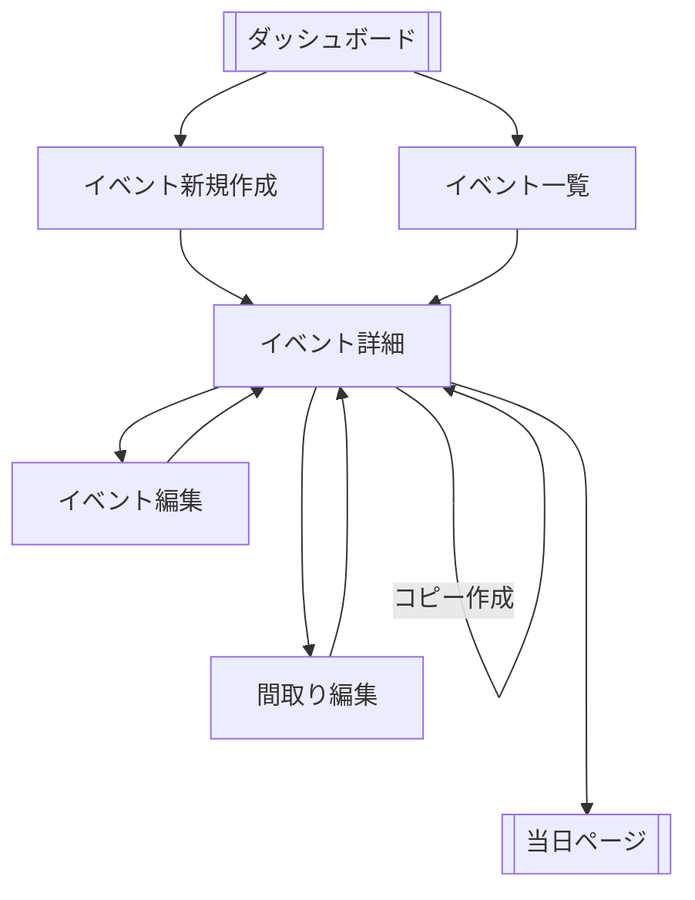

# イベント詳細画面
- 参加者がイベントの情報を確認できる
- 管理者がイベントの情報を確認できる
- 管理者が間取りを編集するかどうかを決められる
- 管理者がイベント情報を編集するかどうかを決める

# 参考ページ
https://pg-beginner-mtg.connpass.com/event/356358/

# 表示項目
## 確実にいるもの（こっちが重要）
- イベント名
- 当日リンク
- イベントの場所
- 開始日
- 終了日
- イベントメモ
- イベント詳細リンク

## 要議論（個人的には欲しいけど）
- 管理しているユーザグループ→いる？
- 申し込みボタン？
- ユーザが残すメモ
- お気に入り機能
- ユーザグループへの遷移

# 画面遷移図（参考）
