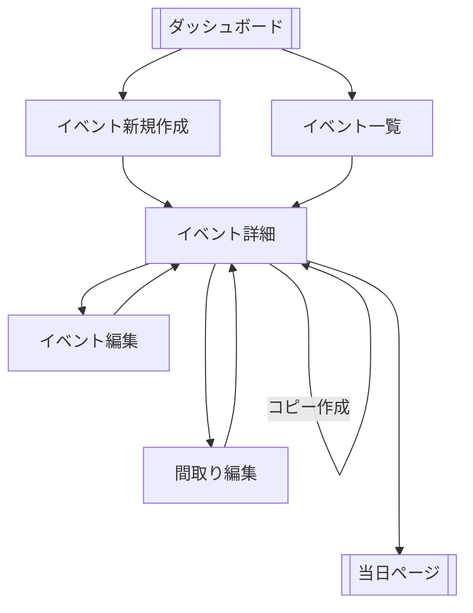

# イベントに関連する画面情報
## 画面一覧
- 新規作成
  - 新規にイベントを作成するための簡単なフォーム 
- イベント一覧画面
  - イベントの一覧を確認する
- 詳細
  - イベントの情報を記載、間取りの確認や、当日参加者用ページへのリンクを提供
- 間取り編集
  - 間取りのエディタのようなもの
- イベント編集
  - イベントに関するメタ情報を保存

## 画面遷移図
