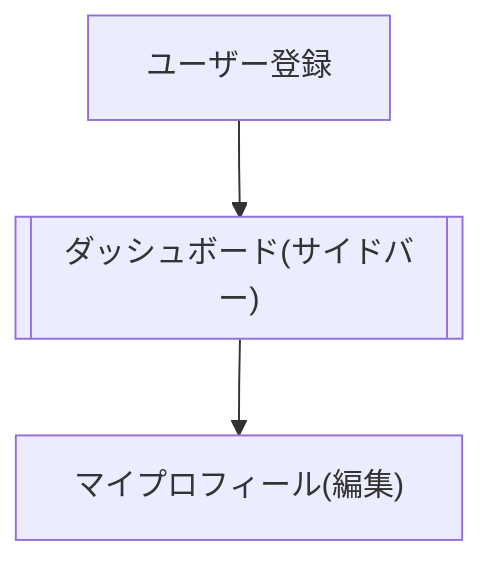

# ユーザー情報に関する画面について
- room/[roomID]以外のページは、ユーザー登録（googleログイン＋ユーザー名、プロフィール記入）を行ってから利用できる。

- ユーザー情報に関する画面は

	- ユーザー登録画面
	- プロフィール編集画面(マイプロフィール)

の2つとする。（今のところ、他人のプロフィールを読んだりはしないので詳細画面は省く）

# プロフィール項目
- ユーザー名(必須)
- プロフィール
- 興味のある分野

# 画面遷移図
