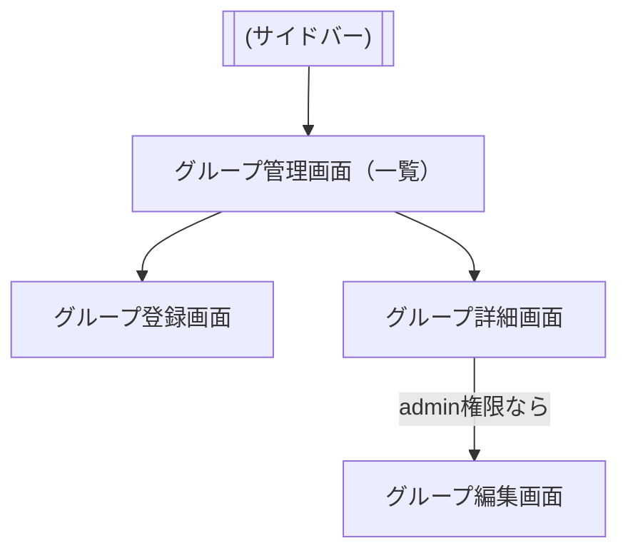

# ユーザーグループ情報に関する画面について
- 画面リスト：

	- グループ管理画面(＝一覧表時機能、各ページ（登録、詳細）へのリンク)
	- グループ登録画面
	- グループ詳細画面
	- グループ編集画面

の2つとする。（今のところ、他人のプロフィールを読んだりはしないので詳細画面は省く）

# グループの登録＆編集項目(初期にはマスト)
- グループ名(必須)
- 概要

# 一覧の各行の要素
- グループ名
- ログインユーザーのロール
- 詳細画面へのリンクボタン

# グループ詳細画面の要素
- グループ名
- 概要
- ログインユーザーのロール
- (ロールがadminの時のみ)編集画面へのリンクボタン

# 発表日（6/22）以降に回すことにする機能
- 他の人がユーザーグループへメンバーとして参加する機能
	- (※ただし、将来のために編集画面を表示できないなどの権限チェックは実装)
- ユーザーグループに人を招待する機能
    - admin
    - member
- グループ削除

# 画面遷移図

20250615_重要
user_group_assignmentsにmemberレコードを追加するのはユーザーがroomに参加した時。
結論：
当日ページ→G認証→当日ページ（Google認証）→当日ページで条件判定して、足りないレコード（user, user_group_assignment）を補う（名前をテキトーに）→空欄だけど。。。
