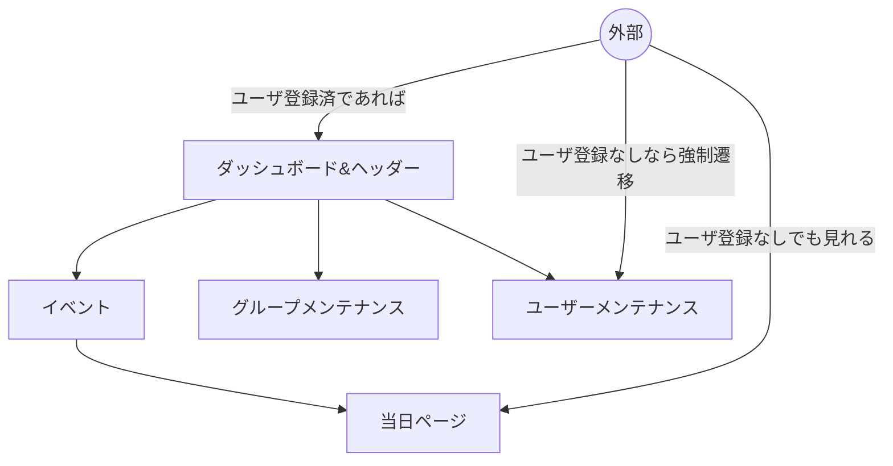

# 大まかに以下に分類

- イベント(やましたさん)
- 当日ページ（ブライアンさん）
- ユーザメンテナンス（いぐちさん）
- グループメンテナンス（いぐちさん）
- ダッシュボード（やましたさん）
- ヘッダとかの共通テンプレート（ブライアンさん）

# 機能遷移図

```mermaid
graph TD;
		Dash["ダッシュボード&ヘッダー"];
		Event["イベント"];
		MaintenanceGroup["グループメンテナンス"];
		MaintenanceUser["ユーザーメンテナンス"];
		todayEvent["当日ページ"];
		Conpass(("外部")) ;
    
    Dash -->  MaintenanceUser;
	  Dash -->  MaintenanceGroup;
	  Event --> todayEvent;
	  Dash --> Event;
	  Conpass --> |"ユーザ登録なしでも見れる"| todayEvent
	  Conpass --> |"ユーザ登録済であれば"| Dash
	  Conpass --> |"ユーザ登録なしなら強制遷移"| MaintenanceUser
  
```