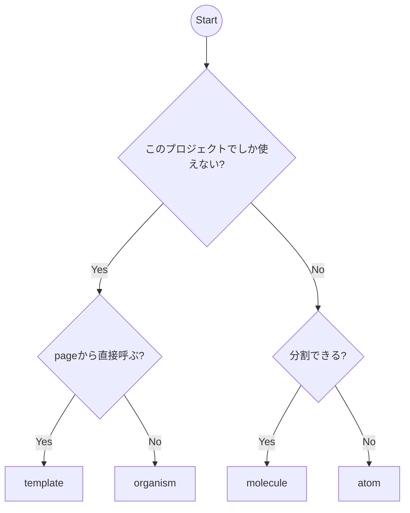

# Atomic Designの規約

## 概要
このプロジェクトでは、UIコンポーネントの設計にAtomic Designの考え方を採用します。
コンポーネントは以下の5つの階層に分類されます：

1. atoms（原子）
2. molecules（分子）
3. organisms（有機体）
4. templates（テンプレート）
5. pages（ページ）<-- 今回は入れないけど、必要に応じて入れるかもです

## 各階層の役割と規約

### atoms（原子）
最も基本的なUIコンポーネントです。

- 場所: `front/src/components/atoms/`
- 特徴:
  - これ以上分解できない最小のUI要素
  - 単一の責務のみを持つ
  - 状態を持たない（stateless）
- 例:
  - ボタン（色付きのボタンとか）
  - 入力フィールド ()
  - アイコン
  - ラベル
  - テキスト
- 補足：
  - shadcnのコンポーネントは改造しない限り分割しないのでこちらにいれてます。
  - ぶっちゃけいるかこれ？と思われるかもしれませんが、プロジェクト内で細かいデザインを統一できるのであった方がいいです

### molecules（分子）
複数のatomsを組み合わせて作られる、より複雑なコンポーネントです。
どんな別のUIでも使えるようなものでatomsを組み合わせて使えるようなものはこっちに書く。

- 場所: `front/src/components/molecules/`
- 特徴:
  - 2つ以上のatomsで構成される
  - 単一の機能を持つ
  - 再利用可能な単位
- 例:
  - 検索フォーム（入力フィールド + ボタン）
  - メニュー項目（アイコン + テキスト）
  - カードヘッダー（アイコン + タイトル）

### organisms（有機体）
moleculesやatomsを組み合わせて作られる、より大きな機能単位のコンポーネントです。
ドメイン（会場とかイベントとか）を含み始めるもの基本こちらに書くでいいかな？

- 場所: `front/src/components/organisms/`
- 特徴:
  - 複数のmoleculesやatomsで構成される
  - 特定の機能やセクションを形成する
  - より複雑な状態管理を持つ可能性がある
- 例:
  - ヘッダーナビゲーション
  - サイドバー
  - フォームセクション
  - カードリスト

### templates（テンプレート）
organismsを配置して、ページの構造を定義するコンポーネントです。
原則、layout.tsxから呼ばれるものと考えてください。

- 場所: `front/src/components/templates/`
- 特徴:
  - ページのレイアウトを定義
  - コンポーネントの配置を管理
- 例:
  - ダッシュボードレイアウト
  - 認証ページレイアウト
  - 設定ページレイアウト


## コンポーネントの作成ガイドライン
長く書いたけど、とりあえず2の次でいいかもしれません。
まずは画面を完成させて、以下のガイドラインに従って綺麗にしていきましょう

1. 単一責任の原則
  - 各コンポーネントは1つの責務のみを持つ
    - これは何のコンポーネントです！と説明できないものは作らない
  - 複数の責務を持つ場合は、より小さなコンポーネントに分割
    - 迷ったら分割するくらいでOK

2. 再利用性
   - 可能な限り再利用可能な形で設計
   - propsを通じて、再利用できるようにしてください。
   - （特にatoms, molecules）propsからclassNameを指定することで、要素のクラスを変更できるようにしてください。

以下、使用例
```ts
/**
 * メニューの行を表示するコンポーネント
 * 
 * このコンポーネントは、アイコンとタイトルを横並びで表示するメニュー行を作成します。
 * デフォルトでは、アイコンは40x40pxのサイズで表示され、タイトルはアイコンの右側に配置されます。
 *  
 * スタイルのカスタマイズ:
 * - divClassName: メニュー行全体のスタイルをカスタマイズします（例：背景色、パディング、ホバー効果など）
 * - iconClassName: アイコンのスタイルをカスタマイズします（例：色、サイズ、アニメーションなど）
 * - titleClassName: タイトルのスタイルをカスタマイズします（例：フォントサイズ、色、太さなど）
 * 
 * 使用例:
　　* なお、iconについては、import { FileText } from "lucide-react";でインポートして使えるものを許可します。
 * @param icon - 表示するアイコン（Lucideアイコン）
 * @param title - 表示するタイトルテキスト
 * @param divClassName - メニュー行のコンテナに適用する追加のクラス名
 * @param iconClassName - アイコンに適用する追加のクラス名
 * @param titleClassName - タイトルに適用する追加のクラス名
 * @returns メニュー行のコンポーネント
 */
export default function MenuUnitRow({ 
  icon: Icon, 
  title, 
  divClassName,
  iconClassName,
  titleClassName 
}: Readonly<Props>) {
  return (
    <div className={cn(defaultDivClassName, divClassName)}>
      <Icon className={cn(defaultIconClassName, iconClassName)}/>
      <span className={cn(titleClassName)}>{title}</span>
    </div>
  )
} 
```


3. ドキュメント(特にorganisms)
   - 各コンポーネントにはJSDocコメントを付ける
   - 使用例を含める
   - 必要なpropsの説明を記述
   - AIでいいので、何かしら用意して欲しいです

4. 迷ったら、以下のフローチャートに従ってください：




5. テスト
   - 各コンポーネントには適切なテストを書く
   - 主要な機能とエッジケースをカバー


## ディレクトリ構造
organism以下から、ドメインの話が出てきます。

```
front/src/
├── components/
│   ├── atoms/
│   │   ├── Button.tsx
│   │   ├── Input.tsx
│   │   ├── shadcn
│   │   │   ├── IconButton.tsx
│   │   │   └── ...
│   │   └── ...
│   ├── molecules/
│   │   ├── SearchForm.tsx
│   │   ├── MenuRow.tsx
│   │   └── ...
│   ├── organisms/
│   │   ├── common/
│   │   │   ├── TopNav.tsx
│   │   │   └── SideNav.tsx
│   │   ├── event/
│   │   │   ├── EventCard.tsx
│   │   │   └── ...
│   │   ├── venue/
│   │   │   ├── VenueCard.tsx
│   │   │   └── ...
│   │   ├── user/
│   │   │   ├── UserProfile.tsx
│   │   │   └── ...
│   │   └── auth/
│   │       ├── LoginForm.tsx
│   │       └── ...
│   └── templates/
│       ├── common/
│       │   ├── DefaultLayout.tsx
│       │   └── ...
│       ├── event/
│       │   ├── EventListLayout.tsx
│       │   └── ...
│       ├── venue/
│       │   ├── VenueListLayout.tsx
│       │   └── ...
│       └── user/
│           ├── UserProfileLayout.tsx
│           └── ...
└── app/
    ├── dashboard/
    │   └── page.tsx
    ├── login/
    │   └── page.tsx
    └── ...
```