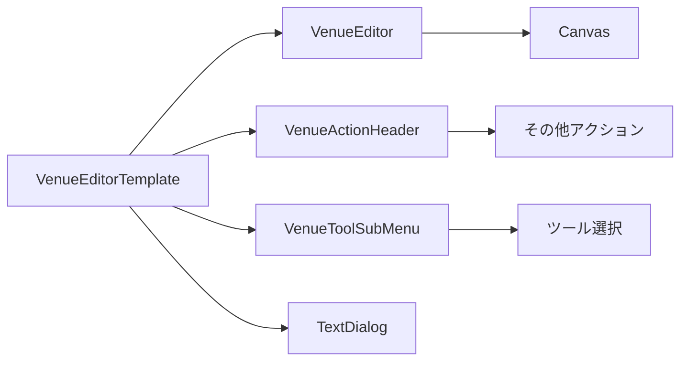
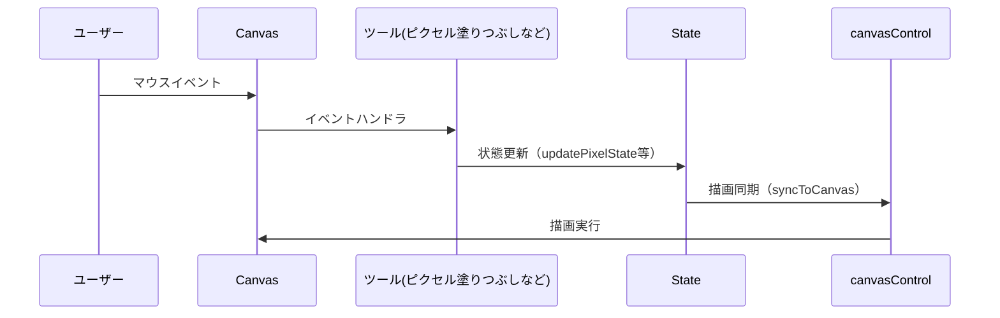
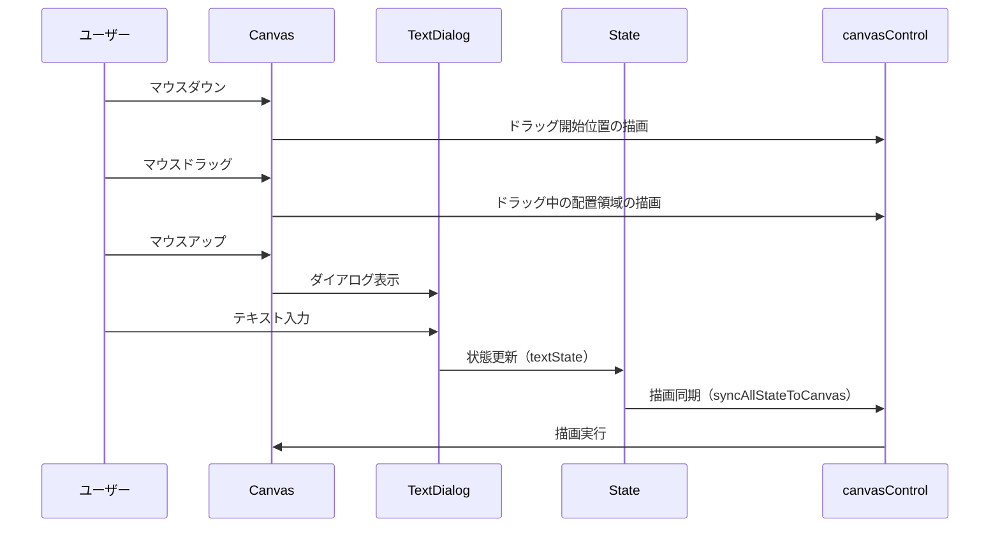
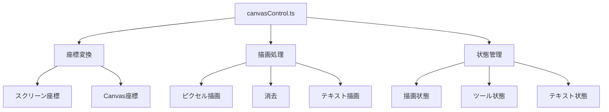
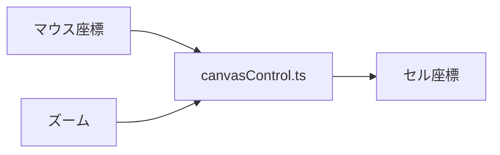

# マウスイベントとCanvasの連動について

## 概要

このドキュメントでは、会場編集機能におけるマウスイベントとCanvas描画の連動について説明します。

## ソースコード構造

```
front/src/
├── hooks/
│   └── event/
│       └── venueedit/
│           ├── tool/
│           │   ├── useCellEditableTool.ts  # セルを一個づつ上書きする場合に使うハンドラーファクトリー
│           │   ├── usePixelDraw.ts         # ピクセル描画ツール
│           │   ├── usePixelErase.ts        # ピクセル消去ツール
│           │   ├── useCircleDraw.ts        # 円形オブジェクト描画ツール
│           │   ├── useCircleErase.ts       # 円形オブジェクト消去ツール
│           │   ├── useTextAdd.ts           # テキスト追加ツール
│           │   └── useToolSelect.ts        # ツール選択管理
│           ├── useTextDialog.ts            # テキストダイアログの状態管理
│           └── useCanvasDraw.ts            # Canvas描画の基本機能
└── lib/
    └── event/
        └── venueedit/
            ├── canvasControl.ts            # Canvas操作のユーティリティ
            └── constants.ts                # 定数定義
```

## テンプレートの構成



## 主要なロジック定義

1. `useCanvasDraw.ts`
   - Templateと直接やりとりするフック
   - ズームに関するアクションも提供
   - イベントハンドラが出力され、TemplateではそのイベントハンドラをCanvasに割り当てる
   - テキスト状態（textState）の管理
   - テキストダイアログの状態管理

2. `useToolSelect.ts`
   - ツールに対応する適切なハンドラ(3に記載)をuseCanvasDrawに渡す
   - ツールの状態管理
   - `canvasControl`の機能を利用
   - テキスト追加ツールの管理

3. ツール実装（定義するのはStateに関するアクションのみ）
   - ツールごとのState管理方法を定義し、useCellEditableToolを通してハンドラを生成する
   - ここで定義するものはStateを変更する関数のみにとどめる
   - 例としては以下の通り
    - `usePixelDraw.ts`: ピクセル描画
    - `usePixelErase.ts`: ピクセル消去
    - `useCircleDraw.ts`: 円形オブジェクト描画
    - `useCircleErase.ts`: 円形オブジェクト消去
    - `useTextAdd.ts`: テキスト追加（ドラッグ操作による配置領域の指定）

4. マウスイベントハンドラファクトリー
   - ツールの実装(Stateの更新関数の定義)からマウスイベントハンドラを生成する
   - `useCellEditableTool.ts`はセルを一個づつ更新するようなツールで使う
   - `useDragging.ts`はドラッグ操作が必要なツール（テキスト追加など）で使う

5. `canvasControl.ts`
   - 座標変換
   - 描画処理
   - グリッド描画
   - stateとCanvasの同期処理
   - テキスト描画処理
     - フォントサイズの自動調整
     - テキストの配置計算
     - 背景色と文字色の設定

### 汎用的なロジックデータフロー


### セルごとに更新するタイプのデータフロー


このフローは以下のツールで使用されます：
- ピクセル塗りつぶし
- ピクセル消去
- 丸オブジェクト配置
- 丸オブジェクト消去

特徴：
1. セル単位での更新
   - マウスイベントで取得した座標をセル座標に変換
   - 1セルずつ状態を更新

2. 即時反映
   - 状態更新後すぐに描画を実行
   - ユーザーの操作に即座に反応

3. シンプルな実装
   - `useCellEditableTool`をラッピング
   - (use${TOOL名})では状態更新関数のみを定義

### テキスト追加のフロー



※ state更新関数の一例として、usePixelDraw.tsなどがある。

### 1. マウスイベントの処理

1. ユーザーがCanvas上でマウス操作を行う
2. `useCanvasDraw`から返されているイベントハンドラが呼び出される
   - `handleMouseDown`: 描画開始
   - `handleMouseMove`: 描画継続
   - `handleMouseUp`: 描画終了
   - `handleMouseLeave`: キャンバスから離れた時

### 2. 状態の更新

1. マウスイベントにより状態(ピクセル配列など)が更新される
2. テキスト追加の場合は、`useTextDialog`を通じて`textState`が更新される
   - テキストの内容

### 3. 描画の同期
#### 3.1 ピクセルごとにStateを更新
1. 状態更新後に`canvasControl.ts`の`syncPixelStateToCanvas`が実行される
2. 更新された状態に基づいてCanvasに描画
#### 3.2 全Stateを一括反映
3. テキストの場合は`syncAllStateToCanvas`で全ての状態を同期
   - フォントサイズの自動調整
   - テキストの配置計算
   - 背景色と文字色の設定

### 4. ツール切り替え時の処理

1. ユーザーがツールを切り替える
2. `useToolSelect`が新しいツールを設定し、対応するイベントハンドラが`useCanvasDraw`から渡される。
3. 前述の手順で、イベントハンドラとCanvasが同期される

## その他トピック

### 1. ツール一覧
| カテゴリ | State | ツール | 機能 | 実装 |
|----------|-------|--------|------|------|
| 単一ピクセル系 | `pixelColorState` | ピクセル塗りつぶし | 1ピクセル単位での描画 | `usePixelDraw.ts` |
| 単一ピクセル系 | `pixelColorState` | ピクセル消去 | ピクセルの削除 | `usePixelErase.ts` |
| 単一ピクセル系 | `circleColorState` | 丸オブジェクト配置 | 円形オブジェクトの配置 | `useCircleDraw.ts` |
| 単一ピクセル系 | `circleColorState` | 丸オブジェクト消去 | 円形オブジェクトの削除 | `useCircleErase.ts` |
| マルチピクセル系 | `textState` | テキストボックス追加 | テキストの配置 | `useTextAdd.ts` |
| マルチピクセル系 | `textState` | テキストボックス消去 | テキストの削除 | `useTextErase.ts` |

### 2. Canvas制御



### 3. ズーム機能

| 機能 | 実装 | 説明 |
|------|------|------|
| ズームイン | `useZoom.ts` | 拡大表示 |
| ズームアウト | `useZoom.ts` | 縮小表示 |
| パン | `useCanvasDraw.ts` | 表示位置の移動 |

### 4. 座標について

座標変換は`canvasControl.ts`の`getCellCoordinates`関数で実装している。



1. マウス座標からキャンバス上の相対座標への変換
   - キャンバスの位置（`rect.left`, `rect.top`）を考慮
   - キャンバスのサイズに基づくスケーリング（`scaleX`, `scaleY`）

2. キャンバス座標からセル座標への変換
   - セルサイズ（`cellSize`）で割って、セルのインデックスを計算
   - 範囲チェック（`numPixel`）による有効な座標の検証

## 新規ツール追加の手順
### Stateの追加が不要である場合

#### 1. ツールの状態管理の実装
  - `hooks/event/venueedit/tool/`に新しいツールのフックを作成
  - ツール固有の状態更新ロジックを実装
    - 例：`useCircleErase.ts`

#### 2. `useToolSelect.ts`への追加
   - `useToolSelect.ts`に新しいツールを追加
   - 例：
     ```typescript
      const circleErase = useCircleErase({  //追加
        canvasRef,
        numPixel,
        selectedColor,
        setPixelColorState,
        pixelColorState,
        setCircleColorState,
        circleColorState
      })
  
      const toolHandlers: Partial<Record<VenueEditTool, ToolHandlers>> = {
        'ピクセル塗りつぶし': pixelDraw,
        'ピクセル消去': pixelErase,
        '丸オブジェクト配置': circleDraw,
        '丸オブジェクト消去': circleErase,　// 追加
      }
     ```

#### 3. Canvas描画の実装（特に新規のStateが必要になった場合）
   - `canvasControl.ts`に新しい描画処理を追加
   - 必要に応じ描画状態の同期処理を実装

### Stateの追加が必要な場合
#### 1. 新規Stateの追加
   - `useCanvasDraw.ts`に新しいStateを追加
   - 初期化処理を追加
   - 例：
     ```typescript
     const [circleColorState, setCircleColorState] = useState<(Color | null)[][]>(
       Array(numPixel).fill(null).map(() => Array(numPixel).fill(null))
     )
     ```

#### 2. Stateの初期化処理の追加
   - `useCanvasDraw.ts`の`useEffect`に初期化処理を追加
   - 例：
     ```typescript
     useEffect(() => {
       const canvas = canvasRef.current
       if (!canvas) return

       const ctx = initializeCanvas(canvas, numPixel, pixelColorState)
       if (!ctx) return

       setPixelColorState(Array(numPixel).fill(null).map(() => Array(numPixel).fill(null)))
       setCircleColorState(Array(numPixel).fill(null).map(() => Array(numPixel).fill(null)))
     }, [numPixel])
     ```

#### 3. 既存のハンドラーファクトリーの更新
   - 新しいStateをハンドラーファクトリーに渡す
   - 例：
     ```typescript
     // useCellEditableTool.ts
     interface Props {
       canvasRef: RefObject<HTMLCanvasElement>
       numPixel: number
       pixelColorState: (Color | null)[][]
       circleColorState: (Color | null)[][]
       updatePixelState: (x: number, y: number) => (Color | null)[][]
       updateCircleState: (x: number, y: number) => (Color | null)[][]
     }
     ```

#### 4. 既存ツールの更新
   - 新しいStateを既存のツールに渡す
   - 例：
     ```typescript
     // usePixelDraw.ts
     interface Props {
       canvasRef: RefObject<HTMLCanvasElement>
       numPixel: number
       selectedColor: Color
       setPixelColorState: Dispatch<SetStateAction<(Color | null)[][]>>
       pixelColorState: (Color | null)[][]
       circleColorState: (Color | null)[][]
       setCircleColorState: Dispatch<SetStateAction<(Color | null)[][]>>
     }
     ```

#### 5. ツールの実装（以降は同じ）
   - 新しいStateを更新する関数を定義
   - `useCellEditableTool`または別のハンドラーファクトリーを使用
   - 例：
     ```typescript
     const updateCircleState = useCallback((x: number, y: number) => {
       const newState = [...circleColorState]
       newState[y] = [...newState[y]]
       newState[y][x] = selectedColor
       setCircleColorState(newState)
       return newState
     }, [selectedColor, circleColorState])
     ```

#### 6. `useToolSelect.ts`の更新
   - 新しいStateとその更新関数を渡す
   - ツール切り替え時の状態リセット処理を追加
   - 例：
     ```typescript
     const { canDraw, handleMouseDown, handleMouseMove, handleMouseUp, handleMouseLeave } = useToolSelect({
       selectedTool,
       selectedColor,
       canvasRef,
       numPixel,
       setPixelColorState,
       pixelColorState,
       setCircleColorState,
       circleColorState
     })
     ```

#### 7. `canvasControl.ts`の更新
   - 新しいStateとCanvasとの描画の同期処理を追加
   - 例：
     ```typescript
     export const syncCircleStateToCanvas = (
       ctx: CanvasRenderingContext2D,
       circleColorState: (Color | null)[][],
       numPixel: number
     ) => {
       // 描画処理
     }
     ```

### 新規のハンドラファクトリが必要になった場合
#### 1. ハンドラーファクトリーの作成
   - `hooks/event/venueedit/tool/`に新しいハンドラーファクトリーを作成
   - 例：
     ```typescript
     // useMultiCellEditableTool.ts
     export const useMultiCellEditableTool = ({
       canvasRef,
       numPixel,
       pixelColorState,
       updatePixelState
     }: Props) => {
       const handleMouseDown = useCallback((e: MouseEvent) => {
         // 複数セルを跨ぐ処理
       }, [/* 依存配列 */])

       const handleMouseMove = useCallback((e: MouseEvent) => {
         // 複数セルを跨ぐ処理
       }, [/* 依存配列 */])

       return {
         handleMouseDown,
         handleMouseMove,
         handleMouseUp,
         handleMouseLeave
       }
     }
     ```

#### 2. Stateの更新(以降はStateの追加が必要な場合の1と同じ)

## 今後の拡張性

1. 新しいツールの追加
   - 既存のアーキテクチャを活用
   - 共通インターフェースの遵守

2. パフォーマンス最適化
   - 描画処理の効率化
   - メモリ使用量の最適化

3. ユーザビリティの向上
   - 直感的な操作感
   - フィードバックの改善