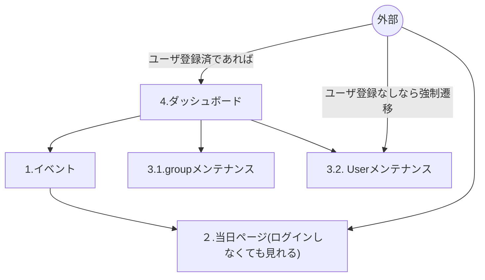

# 1. 作業の運用

## 工数試算(残：180h)

みなさん週どれだけ時間使えますか？

山下：15h / w

井口さん：10h / w

ブライアン：20h / w

週合計：45h

5月25日から成果発表まで、だいたい180h

## ブランチ運用

山下のプロジェクト（手間かかる）

```bash
prod(実際に反映)
- prod-250524 ブランチを準備（リーダーが最終確認して、手動でマージ）
-- prod-250517からcheckout -b 
-- developにある修正からチェリーピックしてます。

- prod-250517 ブランチを準備（リーダーが最終確認して、手動でマージ）
develop(検証環境、SIer, お客さんのシステム担当)
feature
```

井口さん

```bash
prod(実際に反映)→main（自動で反映）
develop(検証環境、SIer, お客さんのシステム担当)
feature
-- developから基本的に分岐して作業する

```

hotfix（緊急修正）

Blianさん

prod→ stable

main → develop

### コミットのテンプレート（developにマージする時）

```bash
${タスク番号} ${タスク名}

- 詳細1
- 詳細2
```

### コミットのテンプレート(featureで作業する時)

```bash
 テキトー
```

feature → 

### 実際の作業例

- 当日ページのモーダルを作ることになりました(タスク番号：345)
- developからfeature/#345を作る
- feature/#345に3個コミット
    - メッセージ：ああああ
    - メッセージ：いいいいい
    - メッセージ：うううう
- feature/#345→developにプルリク
    - メッセージ：〇〇を作りました
- LGTM（良さそう）
- feature/#345 → developにsquashマージ
    - ３つのコミットをまとめて1つにする
    - GitHubのUI上でできます
    - メッセージをちゃんと書く
    
    ```bash
    ${タスク名}　${タスク番号}
    
    - 詳細1
    - 詳細2
    ```
    
    具体例
    
    ```bash
    サンプルタスク #2
    
    - 敬語に変更
    - 最後のURLの手前に改行を挿入
    ```
    
- develop上で綺麗にコミット


## タスク運用

タスクの番号って何？

タスク管理

- Notion管理
- Git追加

### 【オプション】やばい変更をPushした

https://qiita.com/shuntaro_tamura/items/06281261d893acf049ed

ローカル上で打ち消しコミットを作ってください

```bash
git revert コミットのハッシュ値
```

ポイント：慌てずに

# 2. タスク分け（誰が何をやるか）

## 基本ルール

原則：機能ごとに見ていく

例外：共通部分（インフラ(Vercel)、テーブル定義）については、山下でやります

タスクを分割できるならみんなでやるのもあり（同一ファイルをいじるのはやめましょう）

## 機能ごとの分割


### 1. (山下さん) イベント(重要な機能)

- エディタ
    
    1,2,3,4…は同時並行で進められるか
    
- イベント一覧画面含む
- イベント管理（CRUD）
- イベントを作る際には、どのユーザグループに紐づけるかに注意する

### 2. (ブライアンさん)当日ページ(重要な機能)

- 参加者が開く
- 画像データ、フェッチ
- アイコン配置
- 自己紹介
- イベントに参加する

### 3. (井口さん)その他メンテナンス画面(サポート)

- 3.1. ユーザグループメンテナンス（）
    - ユーザ管理機能（CRUD）
    - ユーザグループ管理機能（CRUD）
        - ユーザグループの新規追加は別で置いておく
            - あると便利ですが、新規のUG追加はSQLで対応できるので置いておく
- 3.2. ユーザが使うもの（エディタと当日ページ以外）
    - ユーザ名を決めてください
    - プロフィール編集機能
    - グループ検索機能

- 会場のメタデータ管理機能

### 例

- UG：初学者グループ
- イベント：もくもく会#1
    - 初学者グループのものですよ
- アカウント：
    - いぐちさん：初学者グループの管理者です(マスト)
    - ぶらいあんさん：初学者グループのメンバーです()
    - やました：初学者グループのメンバーです()
- イベント
    - もくもく会#1
        - いぐちさんは編集可能
            - 初学者グループの管理者だから
        - その他のメンバーは
            - 見ることは可能だけど、編集はできない

アカウントは3つあります。（ユーザが簡単に作れるように）

アカウントは自分が管理者のイベントを作れるようにしましょう

- 井口さん（アカウント作成）
- 井口さんがグループ(初学者グループ)を作る
- 井口さんが、初学者グループに紐づくイベント(もくもく会#1)を作る
- メンバーの追加方法
    - UG管理者が自由にユーザを追加する（不要）
        - ユーザが承認するかどうかを判定
        - 招待メール
    - ユーザが参加するものを選ぶ（検索）

### 4. (山下さん)ダッシュボード（ホーム画面）

このダッシュボードから1, 2, 3に飛べる

- 自分が管理しているイベントの一覧
- 自分が属するユーザグループの一覧
- ユーザ登録していなかったら、ユーザ登録画面を出す

### 5. （ブライアンさん）サイドメニュー、ヘッダー

- どの画面にも飛べるようにする
- 基本的にはユーザ登録していれば、フルで機能が使える

### 6. （未定）ログインした後の認可処理

これがなくても一応、1,2,3は作れます。

4ができたタイミングで、別でいれることは可能

