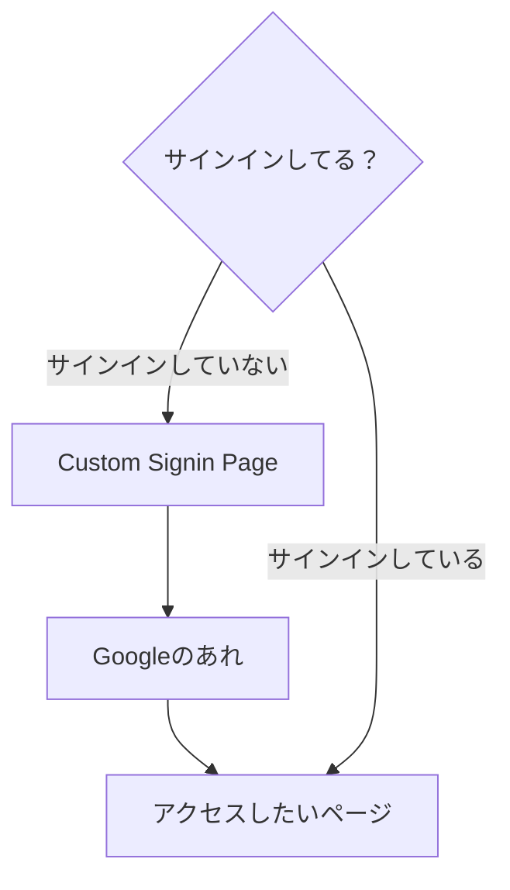

# やりたいこと
前提として、ページそのものはAuthログインされていなければ入れない。
自分たちが用意したサインインボタンを押すと、直接Googleのログイン認証画面が出てくる。

# 画面遷移図


# そのための技術的な問題
## 事象
延々とAuthjsが用意したプロバイダ選択画面が出てくる。

## 事象詳細
- 利用者がサインインを押す
- ブラウザはAuthjsのプロバイダ選択画面が出てくる
- 利用者がGoogleで認証を押す
- ブラウザはAuthjsのプロバイダ選択画面が出てくる
- 利用者がGoogleで認証を押す
- 以下略

# authの仕組み
## 概要
特定のページにアクセスしようとすると、認証が求められる。

## 関連するファイル
- middleware.ts
- lib/auth.ts

## middleware.tsによる認証制御
config.matcher内で、認証なしでもアクセスできるページを定義する（パターンとして定義）。

```ts
export { auth as middleware } from "@/libs/auth/auth"

// Read more: https://nextjs.org/docs/app/building-your-application/routing/middleware#matcher
export const config = {
    matcher: ["/((?!api|_next/static|_next/image|favicon.ico).*)"],
  }
```

## auth.tsによる認証制御
よりわかりやすく定義できるし、他の細かいconfigをいじれる。
middleware.tsはあくまで、auth.tsの情報をエクスポートしているだけ

```ts
import NextAuth from "next-auth"
import "next-auth/jwt"
import Google from "next-auth/providers/google"

export const { handlers, auth, signIn, signOut } = NextAuth({
  debug: !!process.env.AUTH_DEBUG,
  theme: { logo: "https://authjs.dev/img/logo-sm.png" }, // ロゴを設定します
  providers: [
    Google,
  ],
  basePath: "/auth",
  session: { strategy: "jwt" },
  callbacks: {
    authorized({ request, auth }) {
      const { pathname } = request.nextUrl
      if (pathname === "/sandbox") return true // ここでログインパスを制御できます。
      // if (pathname === "/sandbox2") return !!auth (ここは認証済みじゃないと無理)
      return true
    },
    async session({ session, token }) {
      if (token?.accessToken) session.accessToken = token.accessToken

      return session
    },
  },
  experimental: { enableWebAuthn: true },
})
```

# 解決までの道のり
## さっきあげた事象について推論を立てる。
```
- 利用者がサインインを押す
- ブラウザはAuthjsのプロバイダ選択画面が出てくる
- 利用者がGoogleで認証を押す
- ブラウザはAuthjsのプロバイダ選択画面が出てくる
- 利用者がGoogleで認証を押す
- 以下略
```
↓
認証されてないと判断しているから、以下のような動きになっている。

- 利用者がサインインを押す
- システムは認証されていないと判断する
- ブラウザはAuthjsのプロバイダ選択画面が出てくる
- 利用者がGoogleで認証を押す
- システムは認証されていないと判断する
- ブラウザはAuthjsのプロバイダ選択画面が出てくる
- 利用者がGoogleで認証を押す

## 推察
認証する際に、ユーザはlocalhost:3000/auth/signinにアクセスしている。
→/auth/signinについては、認証できていなくても入れるようにすべきなのでは？

以下の対応で問題ない。
- middleware.tsに/next以下へのアクセスを許可する記述を書く
- auth.tsに/next以下へのアクセスを許可する記述を書く

## 新たな疑問点
auth/signinを許可しただけでは、サインインが失敗する
auth/以下全部であればOK

| # | auth.ts | middleware.ts | 結果| 
|--------|------|----------|-----|
|1|if (pathname.startsWith("/auth")) return true|特になし|成功|
|2|if (pathname.startsWith("/auth/signin")) return true|特になし|失敗|
|3|デフォルト|matcherにはauthのみ|成功|
|4|デフォルト|matcherにはauth/signinのみ|失敗|

→ auth/signin以外のauth/?にアクセスしているのでは？
  → auth/callbackに飛ばしていました。

## 解決策
以下のどちらか
- middleware.tsに/next以下へのアクセスを許可する記述を書く
- auth.tsに/next以下へのアクセスを許可する記述を書く

# 情報共有する際のコツ
- Do write!（とりあえず書く、もしくは図で表現する）
    - mermaid(フローチャート)
    - table　（テーブル）
    - List up（箇条書き）
- Move away from technical concepts (or code)（いきなり技術的な目線で語らない）
    - And check your system log.　（あと、コードよりも前にログをみましょう）
- List up flow（フローというか流れをきちんと書く）.
    - 1. user behaviour　（先にユーザからの動きを書いて）
    - 2. system behaviour　（あとでシステムの動きを書く）
    - Do not forget subject and verb　（主語と述語は忘れずに）