 <!--
 _class: lead
 -->

# for Moku
## もくもく会に携わる人々のためのアプリケーション
## @for-mokuチーム

---

 <!--
 _class: agenda
 -->

# アジェンダ
<ul>
  <li class="highlight">for Mokuアプリについて</li>
  <li>開発の流れ</li>
  <li>技術的な話</li>
  <li>感想</li>
  <li>デモ</li>
</ul>

---

# for Moku が解決したい課題

  
  
  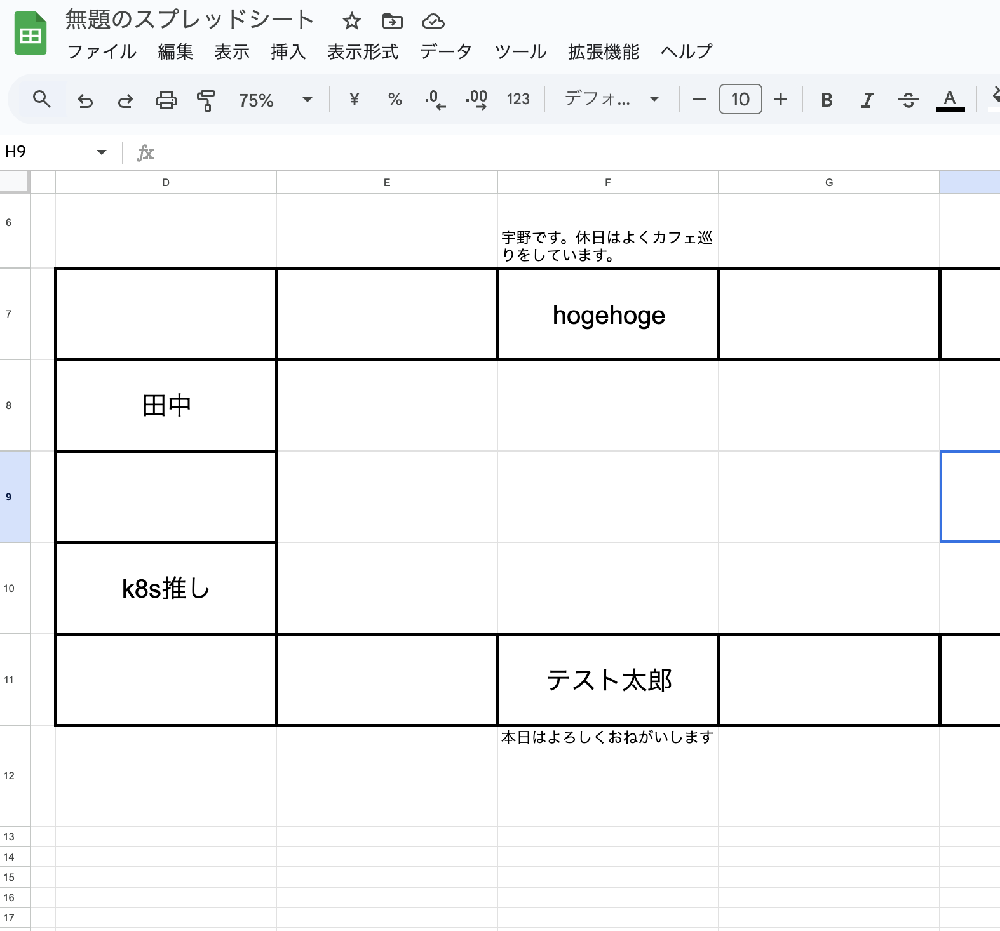

- もくもく会が始まる前はConnpassなどのプラットフォームを使えるけど
- もくもく会の最中に使う管理ツールは意外とない😭
- ??? < また、スプレッドシートかぁ〜

---

# アプリケーションのコンセプト

  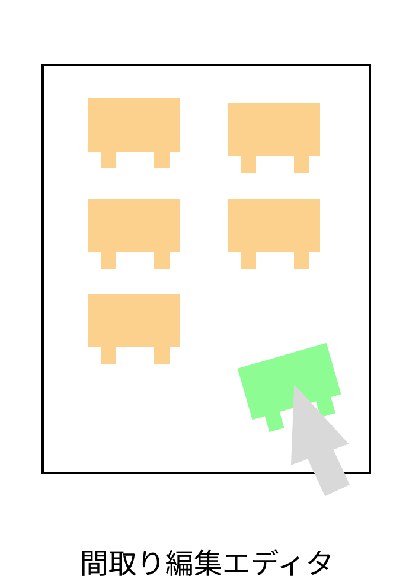
  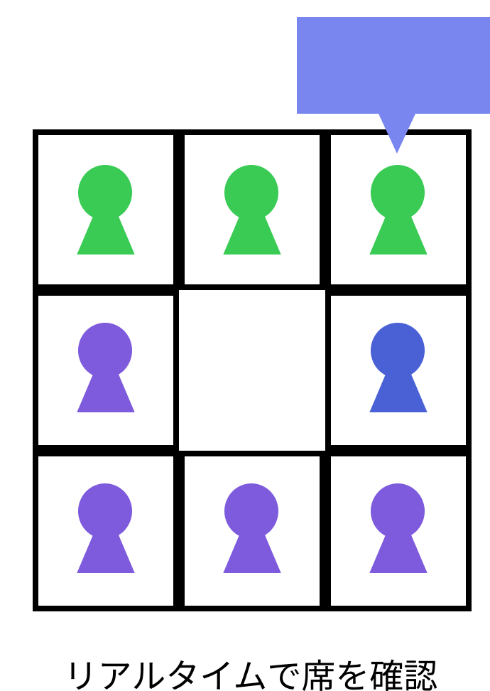
  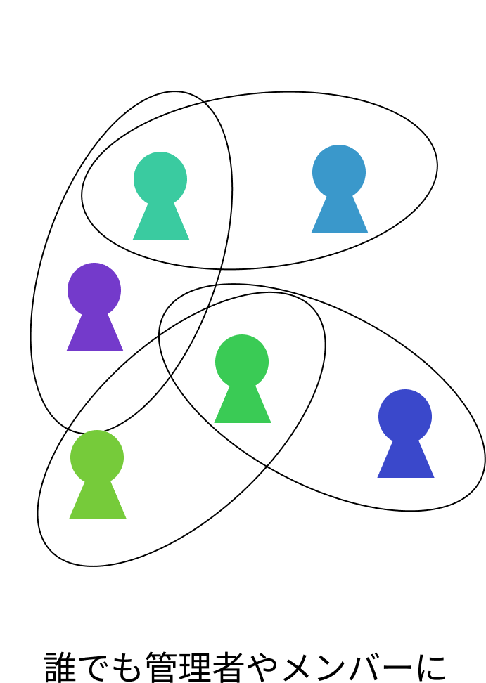

- もくもく会の管理者と参加者の両方をターゲットとして、
- 開催している最中でも使える機能を！

---

 <!--
 _class: agenda
 -->
 
# アジェンダ
<ul>
  <li>for Mokuアプリについて</li>
  <li　class="highlight">開発の流れ</li>
  <li>技術的な話</li>
  <li>感想</li>
  <li>デモ</li>
</ul>

---

# メンバー構成

<table class="profile">
  <tr>
    <td>井口</td>
    <td class="justify-center items-center"></td>
    <td>自己紹介と一言をあわせて80文字程度</td>
  </tr>
  <tr>
    <td>ブライアン</td>
    <td class="justify-center items-center"></td>
    <td>自己紹介と一言をあわせて80文字程度</td>
  </tr>
  <tr>
    <td>山下</td>
    <td class="justify-center items-center"></td>
    <td>
      業界に入ってから2年弱、基幹系システムのSEをやってます。 
      普段書いている、Javaとyml以外の言語を使ってチーム開発をしたいと思い参加しました。 
    </td>
  </tr>
</table>

---
# 開発の様子

  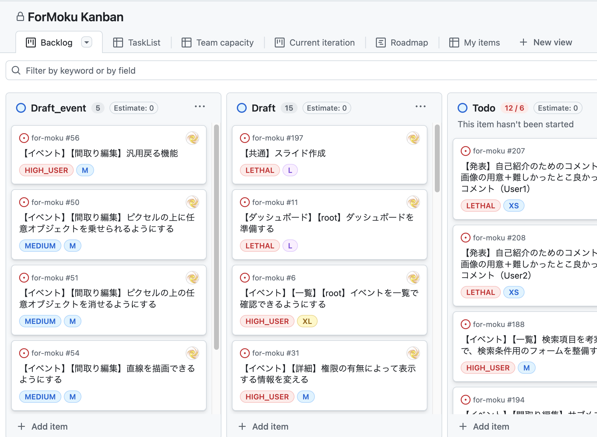
  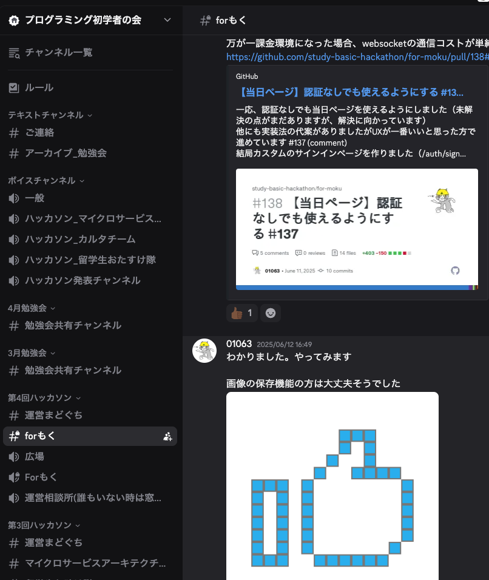
  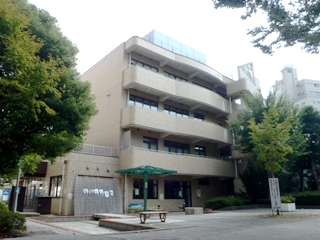

- GitHub Projectsで管理（最低でも優先度とサイズを設定）
- Discordをコミュニケーションツールに
- 週１ペースで対面ミーティングを実施　(目黒@東京の住区センターで実施)

---

 <!--
 _class: agenda
 -->
 
# アジェンダ
<ul>
  <li>for Mokuアプリについて</li>
  <li>開発の流れ</li>
  <li　class="highlight">技術的な話</li>
  <li>感想</li>
  <li>デモ</li>
</ul>

---
# 使用した技術とアーキテクチャ図

  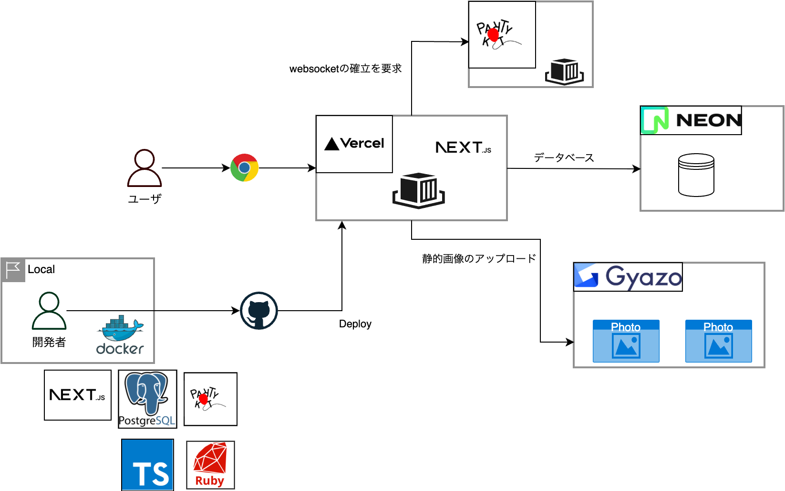

- 「Next.js」「PartyKit」「PostgreSQL」「Gyazo」を活用
- FaaSを等を活用して最低金額0円から始められるように
- コンテナ化することにより、類似の環境をローカルで再現

---

# アプリケーションのコンセプト

  
  
  

- もくもく会の管理者と参加者の両方をターゲットとして、
- 開催している最中に使える機能を！

---
# 間取り編集エディタ
###  → React StateとCanvasとの連携

  
  
  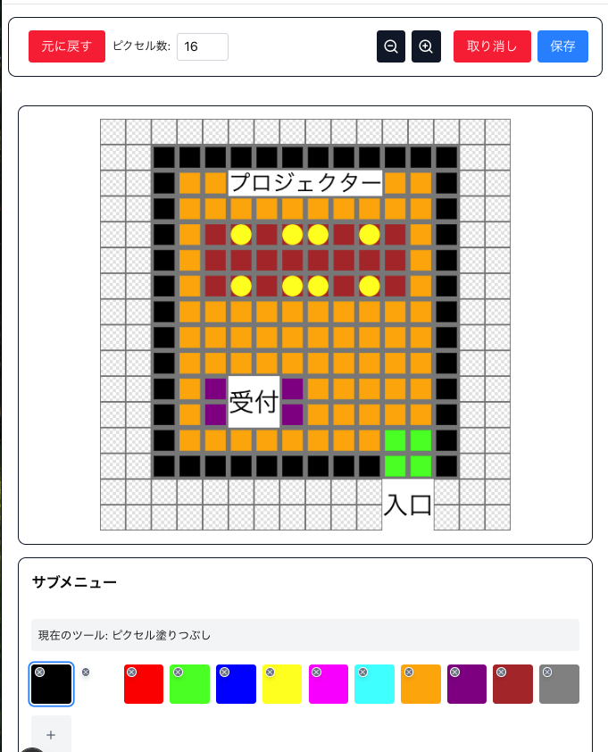

- マウスイベント→Stateの変更→Canvasと同期
- ピクセルの塗りつぶしと消去&テキストの追加ができるように

---

# リアルタイムで席を確認
###  → PartyKit（FaaSサービス）を活用

  
  
  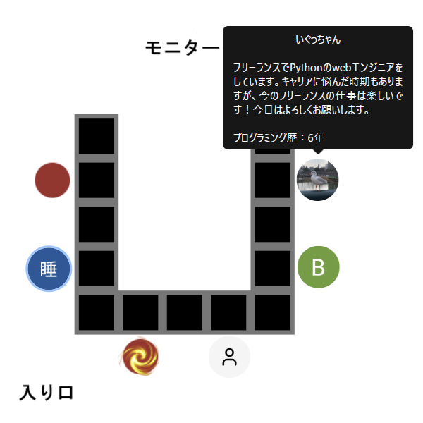

- リアルタイム通信を行うためには、WebSocketを利用できる中継サーバが必要
- PartyKitが管理するサーバーを経由して、ユーザ同士のリアルタイム通信を確立

---
# 誰でも管理者やメンバーに
### → データモデリング

  
  
  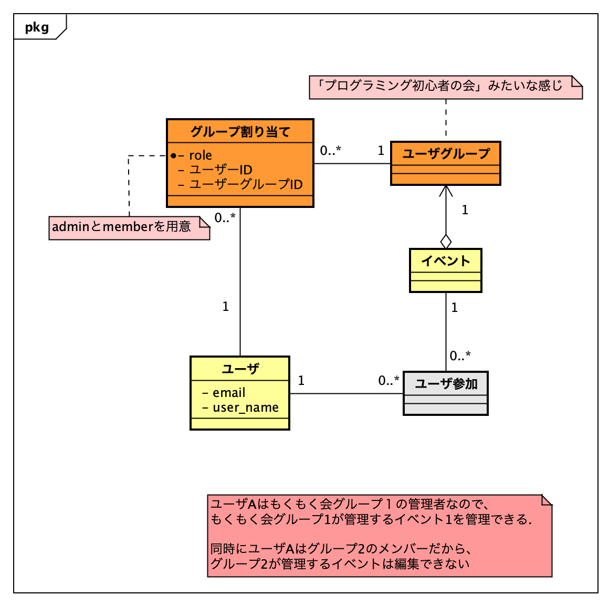

- イベントとユーザと管理者orメンバーは N : N :2で紐づく
- 新規にユーザグループという概念を用意することで柔軟な権限設定ができた

---
 <!--
 _class: agenda
 -->
 
# アジェンダ
<ul>
  <li>for Mokuアプリについて</li>
  <li>開発の流れ</li>
  <li>技術的な話</li>
  <li class="highlight">感想</li>
  <li>デモ</li>
</ul>

---
# やってみて良かったところ

- GitHubのプロジェクト機能を活用することで、互いの進捗を把握しやすくなった
- 色々な技術に触れることができた
- 「ユーザ目線で必要なのか」を優先度の指標として使えた
- 週一で振り返ることができ、柔軟に軌道修正しながらプロジェクトを進めることができた
- その他募集中

---
# 難しかった点

- チャットベースのコミュニケーションだったので、コミュニケーションのミスが生じたこともあった
- 取れる時間が週〇〇時間と決まっているわけではないので、見積もりが困難だった
- 動くコードは書けるんだけど、、、
- その他募集中

---
 <!--
 _class: agenda
 -->
 
# アジェンダ
<ul>
  <li>for Mokuアプリについて</li>
  <li>開発の流れ</li>
  <li>技術的な話</li>
  <li>感想</li>
  <li class="highlight">デモ</li>
</ul>

---

 <!--
 _class: lead
 -->

## 興味があれば参加してみてください