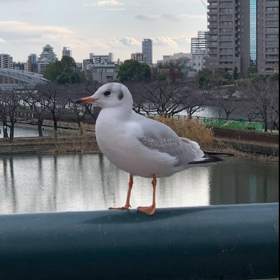
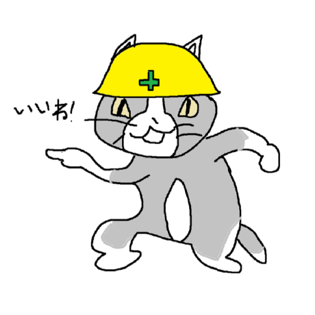
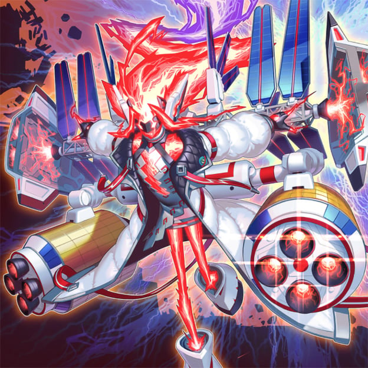

 <!--
 _class: lead
 -->

# for Moku
## もくもく会に携わる人々のためのアプリケーション
## @for-mokuチーム

---

 <!--
 _class: agenda
 -->

# アジェンダ
<ul>
  <li class="highlight">for Mokuアプリについて</li>
  <li>開発の流れ</li>
  <li>技術的な話</li>
  <li>感想</li>
  <li>デモ</li>
</ul>

---

# もくもく会”中”に管理アプリを使っていますか？

  
  

- 管理者 < 会場の間取りをスプシで作るのがとても面倒
- 参加者 < 書くところを間違えること辛い
- ??? < また、スプレッドシートかぁ〜

---

# このアプリケーションのコンセプト

  
  
  

- もくもく会の管理者と参加者の両方をターゲットとして、
- 開催している時もサポートする機能を作る！

---

 <!--
 _class: agenda
 -->
 
# アジェンダ
<ul>
  <li>for Mokuアプリについて</li>
  <li　class="highlight">開発の流れ</li>
  <li>技術的な話</li>
  <li>感想</li>
  <li>デモ</li>
</ul>

---

# メンバー構成

<table class="profile">
  <tr>
    <td>井口</td>
    <td class="justify-center items-center"></td>
    <td>
      昨年から大阪->東京に引っ越してPython(Django)のエンジニアをしています。 
      一応、運営側ではありますが自分も力をつけたく参戦させていただきました！
    </td>
  </tr>
  <tr>
    <td>ブライアン</td>
    <td class="justify-center items-center"></td>
    <td>1月に大学を卒業し、4月に来日したオーストラリア人 
        スキル磨きと就活の息抜きのために参加しました。</td>
  </tr>
  <tr>
    <td>山下</td>
    <td class="justify-center items-center"></td>
    <td>
      業界に入ってから2年弱、基幹系システムのSEをやってます。 
      普段書いている、Javaとyml以外の言語を使ってチーム開発をしたいと思い参加しました。 
    </td>
  </tr>
</table>

---
# 開発の様子

  
  
  

- Github Projectsで管理（最低でも優先度とサイズを設定）
- 週１で対面ミーティングをしていました　(目黒@東京の住区センターで実施)

---

 <!--
 _class: agenda
 -->
 
# アジェンダ
<ul>
  <li>for Mokuアプリについて</li>
  <li>開発の流れ</li>
  <li　class="highlight">技術的な話</li>
  <li>感想</li>
  <li>デモ</li>
</ul>

---
# 使用した技術とアーキテクチャ図

  

---

# 参加者の状態をリアルタイム反映
###  → PartyKitを使って実装

  
  

- リアルタイム通信を行うためには、WebSocketを利用できる中継サーバが必要
- PartyKitサーバを経由して、ユーザ同士のリアルタイム通信を確立

---
# 間取り編集エディタ
###  → React StateとCanvasとの連携

  
  

- HTMLのcanvas要素とマウスイベントの橋渡しとしてStateを利用
- ピクセルの塗りつぶしと消去&テキストの追加ができるように

---
# 誰もが管理者やメンバーになれる
### → データモデリング

  
  

- イベントとユーザと管理者orメンバーは N : N :2で紐づく
- 新規にユーザグループという概念を用意することで柔軟な権限設定ができた

---
 <!--
 _class: agenda
 -->
 
# アジェンダ
<ul>
  <li>for Mokuアプリについて</li>
  <li>開発の流れ</li>
  <li>技術的な話</li>
  <li class="highlight">感想</li>
  <li>デモ</li>
</ul>

---
# やってみて良かったところ

- Githubのプロジェクト機能を活用することで、互いの進捗を把握しやすくなった
- 「ユーザ目線で必要なのか」を優先度の指標として使えた
- 週一で振り返ることができ、柔軟に軌道修正しながらプロジェクトを進めることができた
- もくもく会の運営を進める中で「こういうのがあったらいいな」と思ったものが、ハッカソンで実現できたのは本当に嬉しい
- その他募集中

---
# 難しかった点

- メンバー同士の活動時間が被ることはなかったので、コミュニケーションのミスが生じたこともあった
- 取れる時間が週〇〇時間と決まっているわけではないので、見積もりがかなり困難でした
- TypeScriptやReact,Next.jsが初めてで、限られた時間でキャッチアップしながら開発するのが大変だった（井口）
- その他募集中

---
 <!--
 _class: agenda
 -->
 
# アジェンダ
<ul>
  <li>for Mokuアプリについて</li>
  <li>開発の流れ</li>
  <li>技術的な話</li>
  <li>感想</li>
  <li class="highlight">デモ</li>
</ul>

---

 <!--
 _class: lead
 -->

## 興味があれば参加してみてください